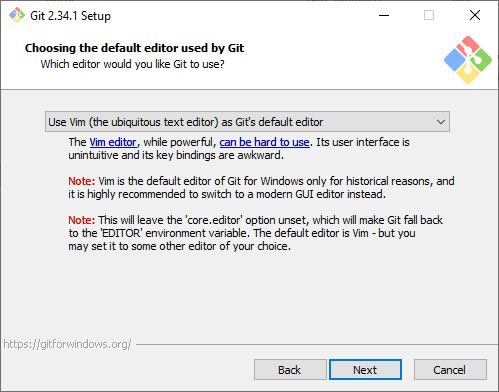
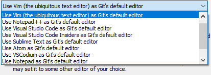

# Using Git & GitHub to manage your research projects

Hello fellows,

I believe you have heard Git & GitHub and probably you have used these tools in your projects.
I myself have used Git a lot and I find it has made my life much easier.

Git, in a simple sentence, is a distributed version control system for tracking code histories and coordinating work among a team.
It is very well-known in the programmer community.
However, I think Git is not just a tool for software development.
It is also a powerful tool for researchers to manage their projects -- it can help you keep your projects organised, trackable and distributable.

In this tutorial, I wish to share with you some experience on how I use Git & GitHub to manage my (text) projects.
This will involve some hands-on practice and will be suitable for beginners.
I hope this will be helpful to you and your future research.

This tutorial will be delivered on Windows 10,
but Git can also be similarly used on Linux (e.g. Ubuntu) systems.

Please refer to the following [Prerequisites](#prerequisites) to install the necessary packages before the tutorial.
Let me know if you have any issues getting these done.

Kind regards,\
Huanneng

-------------

## Prerequisites

### Required
- Have a [GitHub](https://github.com/) account
- Have Git available on your computer
  - For Ubuntu users, install Git by: `sudo apt-get install git`
  - For Windows users, download the installation binary from [git-scm](https://git-scm.com/downloads) and install it.  
    When installing, use the default configurations all the way, except in the following prompt, select the default editor you wish to edit git information.
    If you don't know Vim, it may be a better idea to choose a different text editor.
    If you wish to use Visual Studio Code (i.e. vscode) as the default editor, refer to the [next section](#optional-recommended) to install vscode first.  
      
      

### Optional (recommended)
- Have [VS Code](https://code.visualstudio.com/) on your computer  
  VS Code is an amazing editor for program development and text editing.
  It has become the most popular development tool in recent years.
  VS Code by default comes with Git support and can handle source control visually, which is much more convenient than using git command lines.

